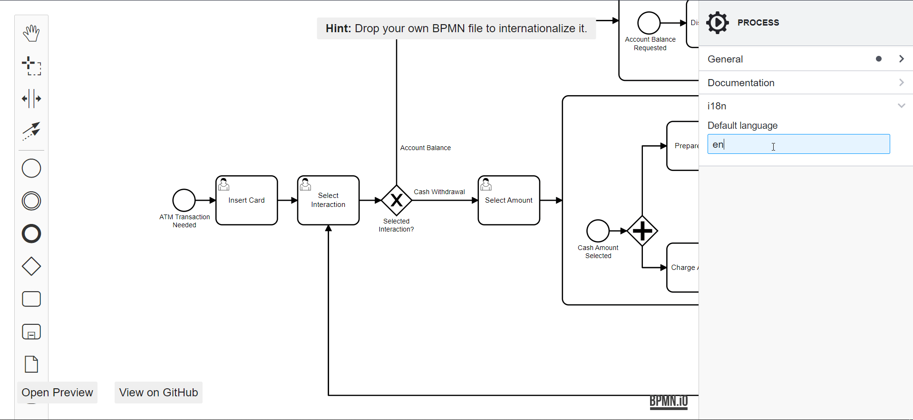

# bpmn-js-i18n 🌎

[](https://github.com/bpmn-io/bpmn-js-i18n/actions?query=workflow%3ACI)

A bpmn-js extension for translating BPMN diagrams using the [BPMN 2.0 extension for internationalization (I18n)](https://github.com/bpmn-miwg/bpmn-i18n).

[](https://bpmn-io.github.io/bpmn-js-i18n)


## Installation

Install via [npm](http://npmjs.com/).

```
npm install bpmn-js-i18n
```

Add as additional module to [bpmn-js](https://github.com/bpmn-io/bpmn-js).

### Modeler

```javascript
import BpmnModeler from 'bpmn-js/lib/Modeler';
import BpmnInternationalizationModule from 'bpmn-js-i18n';

import BpmnI18nSchema from 'bpmn-i18n-moddle/resources/bpmn-i18n.json';

const modeler = new BpmnModeler({
  container: '#canvas',
  additionalModules: [
    BpmnInternationalizationModule
  ],
  moddleExtensions: {
    i18n: BpmnI18nSchema
  }
});
```

### Viewer

```javascript
import BpmnViewer from 'bpmn-js/lib/NavigatedViewer';
import BpmnInternationalizationModule from 'bpmn-js-i18n/lib/viewer';

import BpmnI18nSchema from 'bpmn-i18n-moddle/resources/bpmn-i18n.json';

const viewer = new BpmnViewer({
  container: '#canvas',
  additionalModules: [
    BpmnInternationalizationModule
  ],
  moddleExtensions: {
    i18n: BpmnI18nSchema
  }
});
```


## Build and Run

Prepare the project by installing all dependencies:

```sh
npm install
```

Then, depending on your use-case you may run any of the following commands:

```sh
# build and test
npm run all

# start example
npm start

# run tests in watch mode
npm run dev
```


## Licence

MIT
